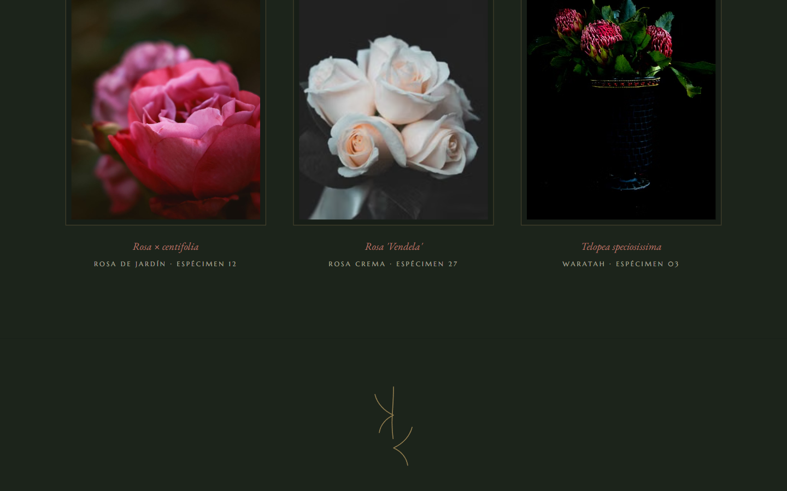

[English](README.en.md) · **Español**

# MADRIGAL — Florería de autor · Ramos de temporada

**Ver en vivo → [https://b0b1a6ae23.github.io/madrigal-floreria/](https://b0b1a6ae23.github.io/madrigal-floreria/)**


Florería de autor con **imágenes 3D reales**: fotografías con mapa de profundidad
que se inclinan y respiran siguiendo el cursor — técnica *fake3d* implementada en
WebGL1 crudo, sin frameworks.

| Hero | Sección |
| --- | --- |
|  |  |

## Técnicas

- **fake3d (estilo akella)**: fragment shader que desplaza el UV según el depth map
  (`uv + (depth - 0.5) * mouse / threshold`), con blur 5-tap del depth en GLSL para
  suavizar bordes, `mirrored()` en los límites, cover-fit por resolución y lerp 0.05.
- **Deriva senoidal autónoma**: las fotos "respiran" solas cuando no hay cursor.
- Cada fotografía va emparejada con su mapa de profundidad en escala de grises.
- 4 instancias WebGL con fallback a `` si el contexto falla.
- Gotcha documentado: si los assets locales cargan más rápido que el layout, el
  canvas mide 0 — re-medición con rAF + `setTimeout` tras subir texturas.
- Tipografía Italiana + Marcellus + EB Garamond; paleta bodegón (#101511).

## Cómo correr

```bash
npx http-server . -p 8080
```

## Licencia

Código bajo licencia [MIT](LICENSE). **MADRIGAL** es una marca ficticia creada para demostrar trabajo de portafolio; cualquier parecido con un negocio real es coincidencia. Los recursos de terceros (fotografías, videos y modelos 3D) conservan la licencia original de sus autores — ver Créditos.

## Créditos

Fotografía y video: [Pexels](https://www.pexels.com) · Técnica fake3d basada en el
experimento de Ashima/akella.

---
**Ángel Josué García Cantero** · Serie *páginas-película*.